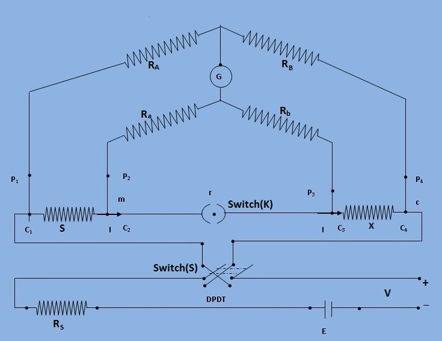
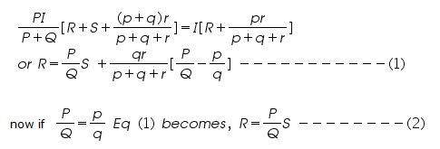

# Introduction

***Kelvin Double Bridge for Low resistance***  Kelvin's double bridge may be used for precision mesurement of four-terminal low resistances. Four terminal resistors have two current leading terminals and two potential terminals across which the resistance equals the marked nominal value. This is because, the current must enter and leave the resistor in a fashion that there is same or equivalent distribution of current density between the particular equipotent surfaces used to define the resistance. The additional points also eliminated any contact resistance at the current lead-in terminals.

***Fig.1 : Schematic diagram for measurement of low resistance by Kelvin double bridge***

## Theory

The kelvin double bridge incorporates the idea of a second set of ratio arms - hence the name double bridge- and the use of four terminal resistors for the low resistance arms. Figure 1 shows the schematic diagram of kelvin bridge. The first ratio arms is P and Q. The second set of ratio arms p and q is used to connect the galvanometer to a point d at the appropriate potential between points m and n to eliminate the effect of connecting lead resistance r between the unknown resistance R and the standard resistance S.

The ratio p/q is made equal to P/Q. Under balance conditions there is no current through the galvanometer which means that the voltage drop between a and b, Eab is equal to voltage drops Eamd between a and c.

$$ E_{ab} = P * \frac{E_{ac}}{P+Q} \ and \ E_{ac} = I*{R + S + r*\frac{p + q}{p+q+r}} $$

$$ E_{amd}= I * {R+\frac{p}{p+q} * (r * \frac{p+q}{p+q+r})} = I * (R + \frac{pr}{p+q+r}) $$

for zero galvanometer deflection, Eab=Eamd

Eq (2) is the usual working equation for the kelvin bridge. It indicates that the resistance of connecting lead, r, has no effect on the measurement, provided that the two sets of ratio arms have equal ratios.

